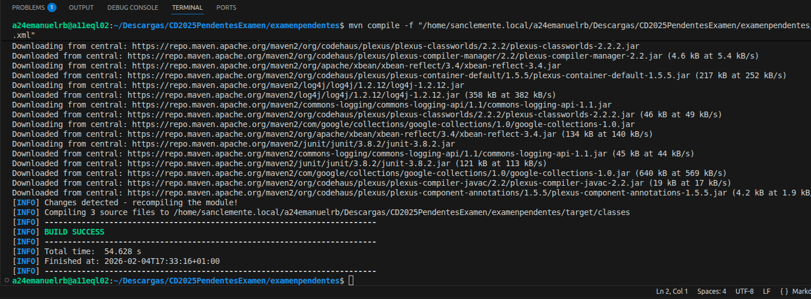
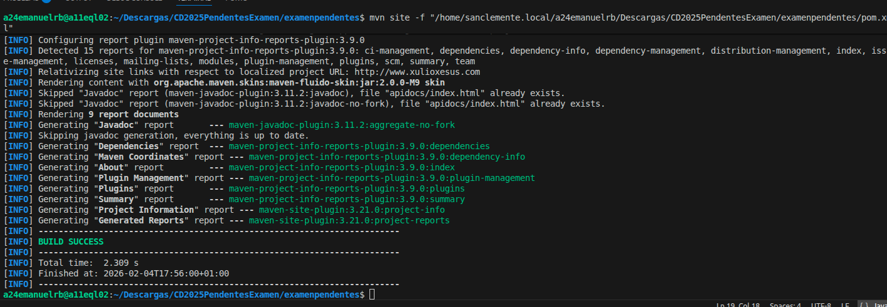
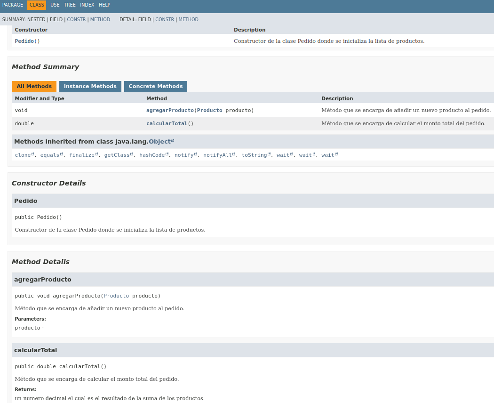
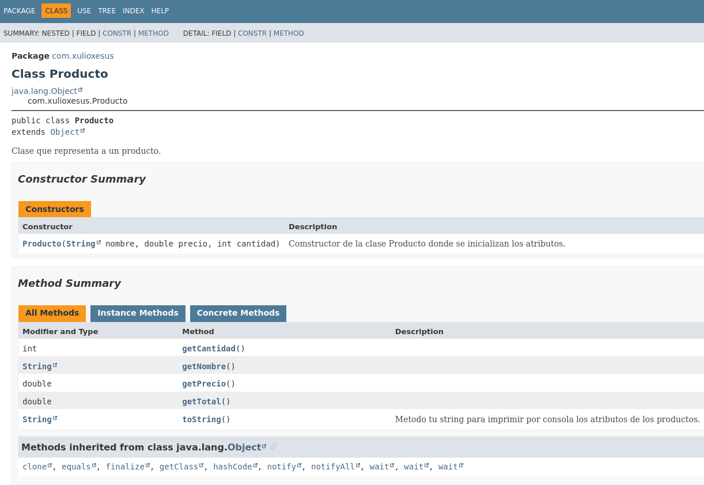

## EJERCICIO 2:

 para refactorizar el codigo que tuve q corregir varias cosas entre ellas la identación, corregir el if, simplificando la expresion, también declare cada variable individualmente y al comentar con java doc tuve q poner cada linea el punto final pq si no tambien marcaba en rojo y no dejaba compilar.

## EJERCICIO 3:

>Para este ejercicio se usó javadoc para comentar todas las clases(3),describiendo sus atributos y metodos como getters y constructores y se generar la documentación se usa el comando mvn javadoc:javadoc
## clase pedido

## Clase producto

## ejercicio 4

Solo se hizo una prueba para el metodo calculartotal, se usó el assert equals para comparar los valores.

